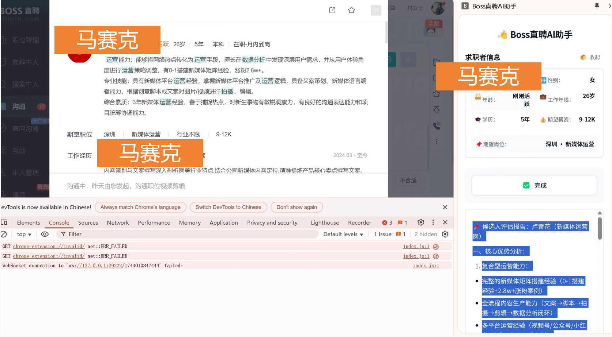
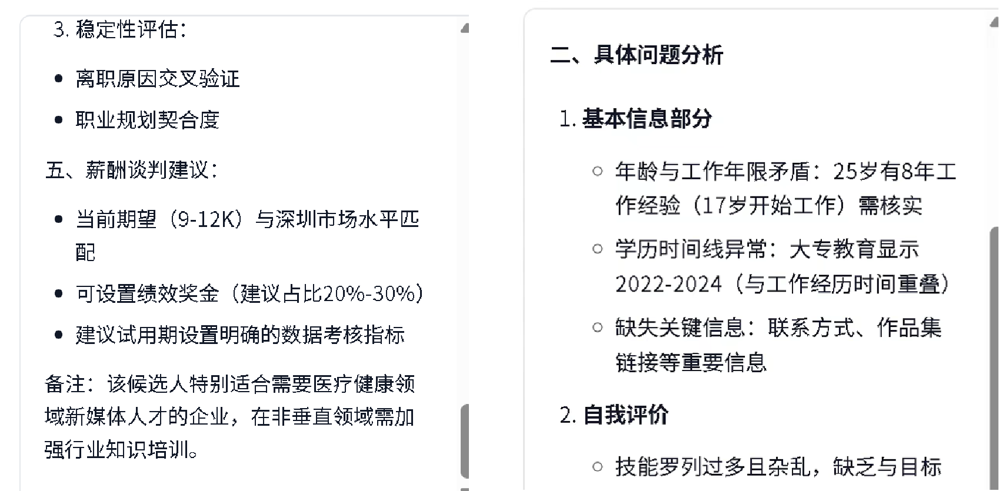

# HRYES

## 中文

HRYES 是一个面向招聘场景的简历分析助手。它把候选人信息提取、AI 简历分析、追问话术生成、候选人打招呼建议等能力整理在同一个项目里。

这个仓库包含一个通用 API 服务端，以及两个桌面客户端版本，方便开发、对比和打包发布。

### 项目预览

#### 程序运行界面



#### 分析报告展示



### 功能特点

- 通用 Express 服务端，负责简历分析和候选人评估
- 使用 OpenAI SDK，兼容 DeepSeek API
- 支持流式返回简历分析和追问问题
- 保留两个 Electron 客户端版本
- 已将密钥移到 `.env`，适合整理后公开上传 GitHub

### 项目结构

```text
hryes/
  server/                 通用 Express API 服务端
  versions/
    v1.0/client/          旧版客户端
    v1.1/client/          当前 Electron 客户端
  scripts/
    publish-github.sh     一键公开发布到 GitHub 的 Git Bash 脚本
```

### 环境要求

- Node.js 18+
- npm
- Git
- GitHub CLI (`gh`)，用于一键发布到 GitHub

### 安装

```bash
npm run install:all
cp .env.example .env
```

然后编辑 `.env`，设置 `DEEPSEEK_API_KEY`。

### 本地开发

启动通用 API 服务端：

```bash
npm run server
```

启动当前 Electron 客户端：

```bash
npm run client:v1.1
```

启动旧版客户端：

```bash
npm run client:v1.0
```

服务端默认使用 `3000` 端口。你可以在 `.env` 中修改：

```text
PORT=3000
```

### 打包

```bash
npm run client:v1.1:build
```

或：

```bash
npm run client:v1.0:build
```

### 发布到 GitHub

先安装并登录 GitHub CLI：

```bash
gh auth login
```

然后在 Git Bash 里运行一行命令，把项目发布为公开 GitHub 仓库：

```bash
./scripts/publish-github.sh hryes
```

你可以把 `hryes` 替换成自己想要的仓库名。

### 安全说明

不要提交 `.env` 或真实 API Key。仓库里只保留 `.env.example` 作为配置示例。

---

## English

HRYES is a resume analysis assistant for recruitment workflows. It combines candidate profile extraction, AI-powered resume analysis, follow-up question generation, and candidate greeting suggestions in one project.

This repository contains one shared API server and two desktop client versions for development, comparison, and release packaging.

### Preview

#### Application Overview


#### Analysis Report


### Features

- Shared Express server for resume analysis and candidate evaluation
- DeepSeek-compatible OpenAI SDK integration
- Streaming AI responses for analysis and follow-up questions
- Two preserved Electron client versions
- Public-repository friendly layout with secrets moved to `.env`

### Project Structure

```text
hryes/
  server/                 Shared Express API server
  versions/
    v1.0/client/          Legacy client
    v1.1/client/          Current Electron client
  scripts/
    publish-github.sh     One-command public GitHub publishing helper for Git Bash
```

### Requirements

- Node.js 18+
- npm
- Git
- GitHub CLI (`gh`) for one-command publishing

### Setup

```bash
npm run install:all
cp .env.example .env
```

Edit `.env` and set `DEEPSEEK_API_KEY`.

### Development

Start the shared API server:

```bash
npm run server
```

Start the current Electron client:

```bash
npm run client:v1.1
```

Start the legacy client:

```bash
npm run client:v1.0
```

The server uses port `3000` by default. You can change it in `.env`:

```text
PORT=3000
```

### Build

```bash
npm run client:v1.1:build
```

or:

```bash
npm run client:v1.0:build
```

### Publish To GitHub

After installing and logging into GitHub CLI:

```bash
gh auth login
```

Publish this folder as a public GitHub repository from Git Bash:

```bash
./scripts/publish-github.sh hryes
```

You can replace `hryes` with any repository name you want.

### Security

Do not commit `.env` or real API keys. This repository includes `.env.example` only.
